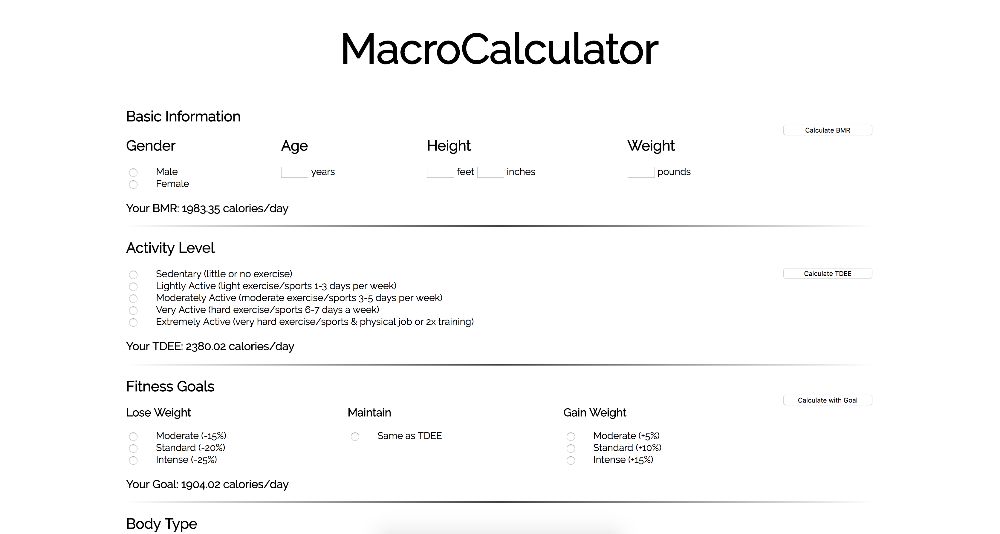

# MacroCalculator

An online calculator that helps users calculate their daily macronutrient (proteins, fats, carbohydrates) needs. The calculator will first calculate a BMR (Basal Metabolic Rate) using the BMR formula and then use the BMR and the user's daily activity level to calculate the user's TDEE (Total Daily Energy Expenditure) using the Harris Benedict Equation. Finally, the user divides up their macros by giving percentages and then gets a total gram count per day for each macronutrient. 

This project also includes a MacroDivider, which can be used if the user already knows their daily target TDEE. The MacroDivider asks for a percentage for each macronutrient and will calculate how many grams per day the user needs for each macronutrient. 

## Design
This was my initial mockup of the MacroCalculator. I only wanted to get the functionality down and did not pay much attention to styling at this point of the project.

I used Material-UI to style and design MacroCalculator.

## Technologies Used
- React.js
- Redux
- Material-UI

### Technologies to Incorporate
- Node.js
- MongoDB

## Future and TODO:
- Incorporate login or authentication via Google or Facebook OAuth
- (Logged in user) Macronutrient Journal: extend this app to allow users to keep track of daily macronutrients.
- Mobile-friendly
